<div align="center">

# $\color{#F1261D}{𝗙}\color{#FF9200}{𝗠}\color{#FDDB2A}{𝗖}\color{#4DE42B}{𝗪}\color{#0FF692}{\text{-}}\color{#0BD8F9}{𝗟}\color{#2C22FB}{𝗜}\color{#C32DF3}{𝗢}$<br>A Doppler LiDAR-Inertial Odometry

<a href="https://ieeexplore.ieee.org/document/10518074"></a>
<a href="https://arxiv.org/abs/2609.29374"></a>
<a href="https://youtu.be/2yuZYw91AP8"></a>
<a href="https://huggingface.co/datasets/zha0ming1e/FMCW-LIO_Dataset"></a>
<a href="https://drive.google.com/drive/folders/17EenivWTAenEyNQexaLnnJ5iHd6pAKX7?usp=sharing"></a>

[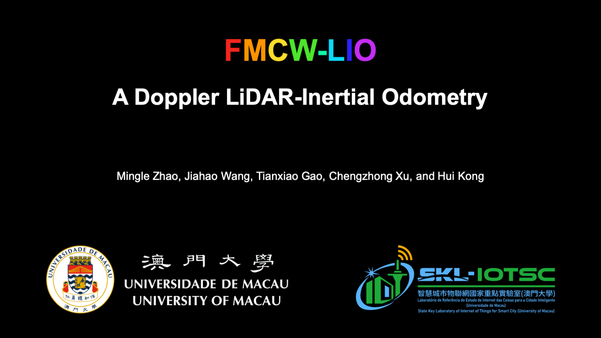](https://youtu.be/2yuZYw91AP8 "FMCW-LIO: A Doppler LiDAR-Inertial Odometry")

</div>

<p align="center">
  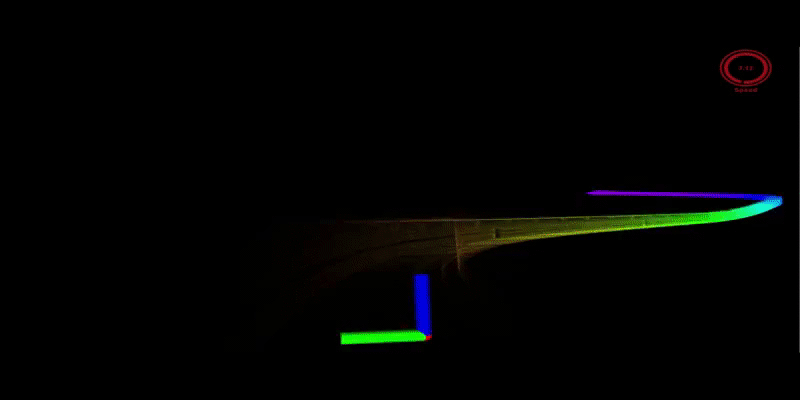
  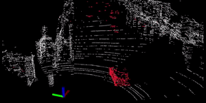
</p>
<p align="center">
  
  
</p>

## 1. Introduction
$\color{#F1261D}{𝗙}\color{#FF9200}{𝗠}\color{#FDDB2A}{𝗖}\color{#4DE42B}{𝗪}\color{#0FF692}{\text{-}}\color{#0BD8F9}{𝗟}\color{#2C22FB}{𝗜}\color{#C32DF3}{𝗢}$ is a 4D Doppler LiDAR-inertial odometry framework that exploits intrinsic Doppler velocity measurements provided by FMCW Doppler LiDARs. To properly incorporate Doppler information, a motion compensation scheme is introduced together with a Doppler-aided observation model for on-manifold state estimation. Doppler-based criteria are further employed to effectively reject dynamic points, yielding more consistent geometric observations. As a result, $\color{#F1261D}{𝗙}\color{#FF9200}{𝗠}\color{#FDDB2A}{𝗖}\color{#4DE42B}{𝗪}\color{#0FF692}{\text{-}}\color{#0BD8F9}{𝗟}\color{#2C22FB}{𝗜}\color{#C32DF3}{𝗢}$ achieves accurate state estimation and static mapping even in structure-degenerated environments. Furthermore, a scan-free, motion-free, and correspondence-free initialization method, $\color{#FF577E}{𝙁𝙧𝙚𝙚\text{-}𝙄𝙣𝙞𝙩}$ ([**DOI**](https://doi.org/10.1109/LRA.2024.3490395) | [**Project Page**](https://github.com/IMRL/Free-Init)), is also integrated into $\color{#F1261D}{𝗙}\color{#FF9200}{𝗠}\color{#FDDB2A}{𝗖}\color{#4DE42B}{𝗪}\color{#0FF692}{\text{-}}\color{#0BD8F9}{𝗟}\color{#2C22FB}{𝗜}\color{#C32DF3}{𝗢}$.
<p align="center">
  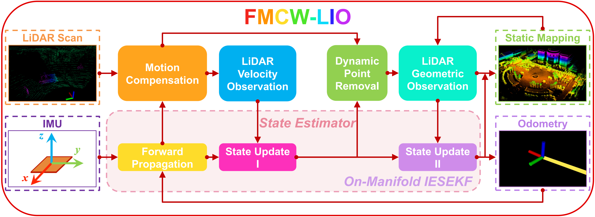
</p>

$\color{#F1261D}{𝗙}\color{#FF9200}{𝗠}\color{#FDDB2A}{𝗖}\color{#4DE42B}{𝗪}\color{#0FF692}{\text{-}}\color{#0BD8F9}{𝗟}\color{#2C22FB}{𝗜}\color{#C32DF3}{𝗢}$ supports both 4D and 3D LiDARs and delivers accurate mapping across a wide range of challenging environments. The following examples highlight its performance in both structured and degenerated scenes.
<p align="center">
  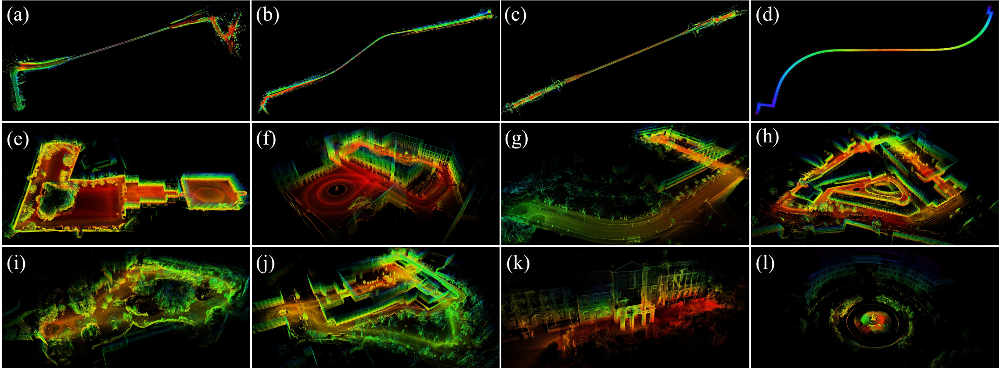
</p>

## 2. Framework Highlights

- ⏱️ **Doppler Compensation**: A Doppler compensation scheme aligns Doppler velocity measurements into a unified spatiotemporal frame. Beyond motion compensation, Doppler compensation essentially reveals the interrelation between the Doppler velocities of a static point with respect to arbitrary different frames.
- 🚀 **Flexible Initialization**: Multiple initialization algorithm and strategies are supported, including conventional stationary initialization and $\color{#FF577E}{𝙁𝙧𝙚𝙚\text{-}𝙄𝙣𝙞𝙩}$ ([**DOI**](https://doi.org/10.1109/LRA.2024.3490395) | [**Project Page**](https://github.com/IMRL/Free-Init)), which delivers accurate initial states even in the presence of aggressive motion, moving objects, and structure degeneracy.
- 🧭 **Multiple Integration & Motion Compensation Schemes**: Various integration and motion compensation methods are provided, including second-order Runge-Kutta method (RK2), third-order Runge-Kutta method (RK3), fourth-order Runge-Kutta method (RK4), mechanization, and ACI2.
- 🛡️ **Robust Velocity Estimation**: Multiple algorithms are integrated to improve the resilience and accuracy of velocity estimation, including least squares with RANSAC, covariance, and robust kernels.
- 🗺️ **Multiple Map Structures**: Different map structures are supported, including [ikd-Tree](https://doi.org/10.1109/TRO.2022.3141876) and [iVox](https://doi.org/10.1109/LRA.2022.3152830), enabling flexible and efficient mapping under varying resources and environments.
- 📡 **Multiple LiDAR Types**: The framework is compatible with both 4D Doppler LiDARs and conventional 3D LiDARs, facilitating evaluation and deployment across different LiDAR sensing configurations.

## 3. Docker
**All experimental results are obtained in the provided Docker environment.**
### 3.1 Build Docker Image
```bash
mkdir -p ./fmcw_lio_ws/src/
cd ./fmcw_lio_ws/src/
git clone https://github.com/IMRL/FMCW-LIO.git
cd ./FMCW-LIO/docker/
docker build -t fmcw_lio:latest .
```

### 3.2 Launch Container
```bash
chmod +x run_docker.sh

# dataset path will be mounted to /datasets inside the container
./run_docker.sh /path/to/fmcw_lio_ws /path/to/dataset
```

### 3.3 Run
```bash
# at FMCW-LIO workspace
rm -rf ./devel/ ./build/ && catkin_make
source ./devel/setup.bash
# take FMCW-LIO dataset as an example
roslaunch fmcw_lio aeva64_fmcw_lio_structured.launch

# open another terminal to play bag
docker exec -it fmcw_lio bash
source /opt/ros/noetic/setup.bash
rosbag play --pause /path/to/bag
```

## 4. Native Installation
### 4.1 Prerequisites
- **Ubuntu and ROS**
  - Ubuntu 20.04.
  - ROS Noetic, please follow [ROS Installation](https://wiki.ros.org/ROS).

- **PCL and Eigen**
  - PCL 1.9, please follow [PCL Installation](https://pointclouds.org/).
  - Eigen 3.3.7, please follow [Eigen Installation](https://libeigen.gitlab.io/).

- **Livox ROS Driver**
  - Please follow [livox_ros_driver](https://github.com/Livox-SDK/livox_ros_driver).

### 4.2 Build
```bash
mkdir -p ./fmcw_lio_ws/src/
cd ./fmcw_lio_ws/src/
git clone https://github.com/IMRL/FMCW-LIO.git
cd ../ && rm -rf ./devel/ ./build/ && catkin_make
source ./devel/setup.bash
```

### 4.3 Run
```bash
# take FMCW-LIO dataset as an example
roslaunch fmcw_lio aeva64_fmcw_lio_structured.launch

# open another terminal to play bag
rosbag play --pause /path/to/bag
```

If launch is successful, terminal should display the $\color{#F1261D}{𝗙}\color{#FF9200}{𝗠}\color{#FDDB2A}{𝗖}\color{#4DE42B}{𝗪}\color{#0FF692}{\text{-}}\color{#0BD8F9}{𝗟}\color{#2C22FB}{𝗜}\color{#C32DF3}{𝗢}$ system information similar to the following:
<p align="center">
  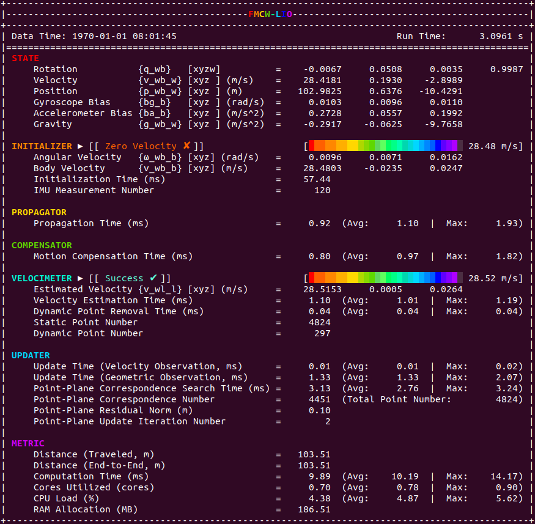
</p>

## 5. Launch File Selection
$\color{#F1261D}{𝗙}\color{#FF9200}{𝗠}\color{#FDDB2A}{𝗖}\color{#4DE42B}{𝗪}\color{#0FF692}{\text{-}}\color{#0BD8F9}{𝗟}\color{#2C22FB}{𝗜}\color{#C32DF3}{𝗢}$ provides dedicated launch files for different 4D/3D LiDAR sensors, datasets, and sequence configurations. Please select the corresponding launch file according to the specific dataset and sequence.

<table align="center">
  <thead>
    <tr>
      <th align="center" width="320">Dataset</th>
      <th align="center" width="340">Sequence</th>
      <th align="center" width="330">Launch File</th>
    </tr>
  </thead>
  <tbody>
    <tr>
      <td align="center" rowspan="2"><a href="https://github.com/IMRL/FMCW-LIO"><strong>FMCW-LIO Dataset</strong></a></td>
      <td align="center">FMCW-LIO_campus_01<br>FMCW-LIO_street_01<br>FMCW-LIO_stpaul_01</td>
      <td align="center">aeva64_fmcw_lio_structured.launch</td>
    </tr>
    <tr>
      <td align="center">FMCW-LIO_tunnel_01<br>FMCW-LIO_tunnel_03</td>
      <td align="center">aeva64_fmcw_lio_tunnel.launch</td>
    </tr>
    <tr>
      <td align="center" rowspan="3"><a href="https://github.com/IMRL/Free-Init"><strong>Free-Init Dataset</strong></a></td>
      <td align="center">Free-Init_handheld_campus</td>
      <td align="center">aeva64_fmcw_lio_structured.launch<br><sub>(set <code>init_method: 3</code> in its YAML file)</sub></td>
    </tr>
    <tr>
      <td align="center">Free-Init_handheld_tunnel</td>
      <td align="center">aeva64_fmcw_lio_tunnel.launch<br><sub>(set <code>init_method: 3</code> in its YAML file)</sub></td>
    </tr>
    <tr>
      <td align="center">Free-Init_vehicular_highway<br>Free-Init_vehicular_tunnel</td>
      <td align="center">aeva64_freeinit_vehicular.launch</td>
    </tr>
    <tr>
      <td align="center"><a href="https://www.boreas.utias.utoronto.ca/#/boreasRT"><strong>Boreas-RT Dataset</strong></a></td>
      <td align="center">All</td>
      <td align="center">aeva64_boreas_rt.launch</td>
    </tr>
    <tr>
      <td align="center"><a href="https://sites.google.com/view/herculesdataset"><strong>HeRCULES Dataset</strong></a></td>
      <td align="center">All</td>
      <td align="center">aeva64_hercules.launch</td>
    </tr>
    <tr>
      <td align="center" rowspan="2"><a href="https://ori-drs.github.io/newer-college-dataset/"><strong>Newer College Dataset</strong></a></td>
      <td align="center">Stereo Vision Lidar IMU Dataset</td>
      <td align="center">ouster64_newer_college_dataset.launch</td>
    </tr>
    <tr>
      <td align="center">Multi-camera Vision Lidar IMU Dataset</td>
      <td align="center">ouster128_newer_college_dataset.launch</td>
    </tr>
    <tr>
      <td align="center"><a href="https://dynamic.robots.ox.ac.uk/datasets/oxford-spires/"><strong>Oxford Spires Dataset</strong></a></td>
      <td align="center">All</td>
      <td align="center">hesai64_oxford_spires_dataset.launch</td>
    </tr>
    <tr>
      <td align="center" rowspan="2"><a href="https://mcdviral.github.io/"><strong>Multi-Campus Dataset</strong></a></td>
      <td align="center">KTH &amp; TUHH Sequences</td>
      <td align="center">ouster64_mcd_kth_tuhh.launch</td>
    </tr>
    <tr>
      <td align="center">NTU Sequences</td>
      <td align="center">ouster128_mcd_ntu.launch</td>
    </tr>
    <tr>
      <td align="center"><a href="https://ntu-aris.github.io/ntu_viral_dataset/"><strong>NTU VIRAL Dataset</strong></a></td>
      <td align="center">All</td>
      <td align="center">ouster16_ntu_viral.launch</td>
    </tr>
    <tr>
      <td align="center"><a href="https://hilti-challenge.com/dataset-2022"><strong>Hilti SLAM Challenge Dataset 2022</strong></a></td>
      <td align="center">All</td>
      <td align="center">hesai32_hilti_slam_2022.launch</td>
    </tr>
    <tr>
      <td align="center"><a href="https://github.com/IPNL-POLYU/UrbanNavDataset"><strong>UrbanNav Dataset</strong></a></td>
      <td align="center">All</td>
      <td align="center">velodyne32_urbannav.launch</td>
    </tr>
    <tr>
      <td align="center"><a href="https://github.com/hku-mars/FAST_LIO"><strong>FAST-LIO2 Dataset</strong></a></td>
      <td align="center">All</td>
      <td align="center">livox_avia_fast_lio2.launch</td>
    </tr>
    <tr>
      <td align="center"><a href="https://github.com/hku-mars/FAST-LIVO2"><strong>FAST-LIVO2 Dataset</strong></a></td>
      <td align="center">All</td>
      <td align="center">livox_avia_fast_livo2.launch</td>
    </tr>
  </tbody>
</table>

## 6. FMCW-LIO Dataset
The collected FMCW Doppler LiDAR-inertial dataset ([**FMCW-LIO Dataset**](https://github.com/IMRL/FMCW-LIO)) is available on [**Hugging Face**](https://huggingface.co/datasets/zha0ming1e/FMCW-LIO_Dataset) and [**Google Drive**](https://drive.google.com/drive/folders/17EenivWTAenEyNQexaLnnJ5iHd6pAKX7?usp=sharing). The characteristics of each sequence are summarized in the following table. All sequences are start-end aligned, all returning to starting points, making end-to-end distance (E2E) a measure of drifted error.
<table align="center">
  <thead>
    <tr>
      <th align="center" width="265">Sequence</th>
      <th align="center" width="255">Preview</th>
      <th align="center" width="255">FMCW-LIO Map</th>
      <th align="center" width="105">Platform</th>
      <th align="center" width="105">Distance (m)</th>
      <th align="center" width="105">Duration (s)</th>
    </tr>
  </thead>
  <tbody>
    <tr>
      <td align="center"><a href="https://drive.google.com/file/d/1GPxrgxQkM45SlCIrQkOTgbPpzX6FXMGu/view?usp=sharing">FMCW-LIO_campus_01</a></td>
      <td align="center"></td>
      <td align="center">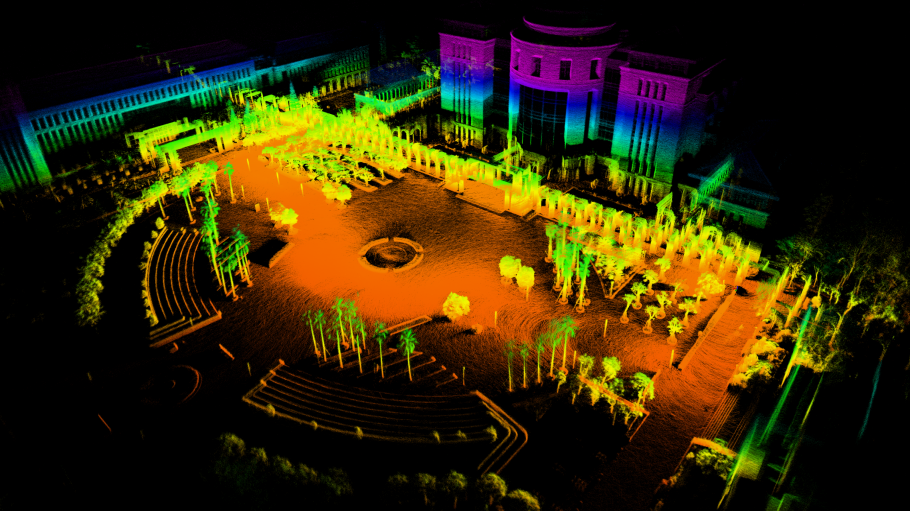</td>
      <td align="center">Handheld</td>
      <td align="center">425</td>
      <td align="center">347</td>
    </tr>
    <tr>
      <td align="center"><a href="https://drive.google.com/file/d/1TO7XkB26KC9XLbMx6vgmmUvKWjTPhhx5/view?usp=sharing">FMCW-LIO_street_01</a></td>
      <td align="center">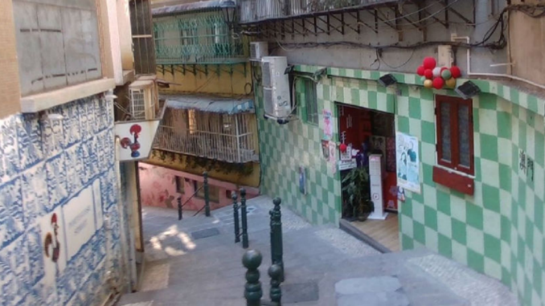</td>
      <td align="center">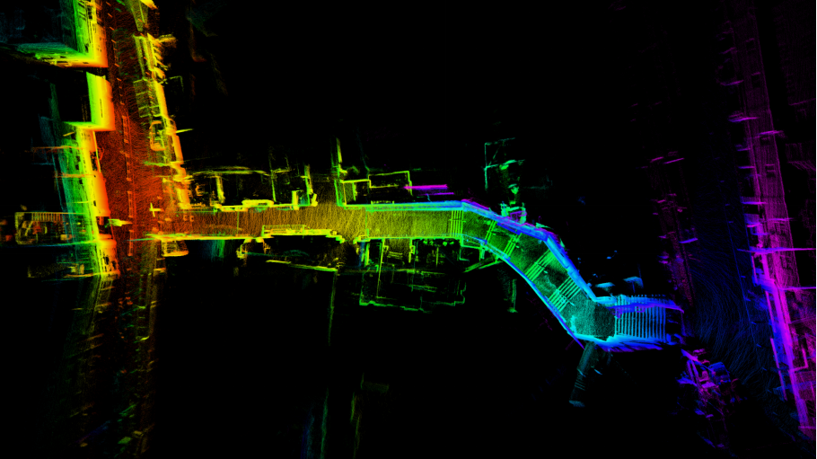</td>
      <td align="center">Handheld</td>
      <td align="center">183</td>
      <td align="center">177</td>
    </tr>
    <tr>
      <td align="center"><a href="https://drive.google.com/file/d/1tYPp_B6OXRB2yqqVqoRsXmT1ZuNz2yoC/view?usp=sharing">FMCW-LIO_tunnel_01</a></td>
      <td align="center">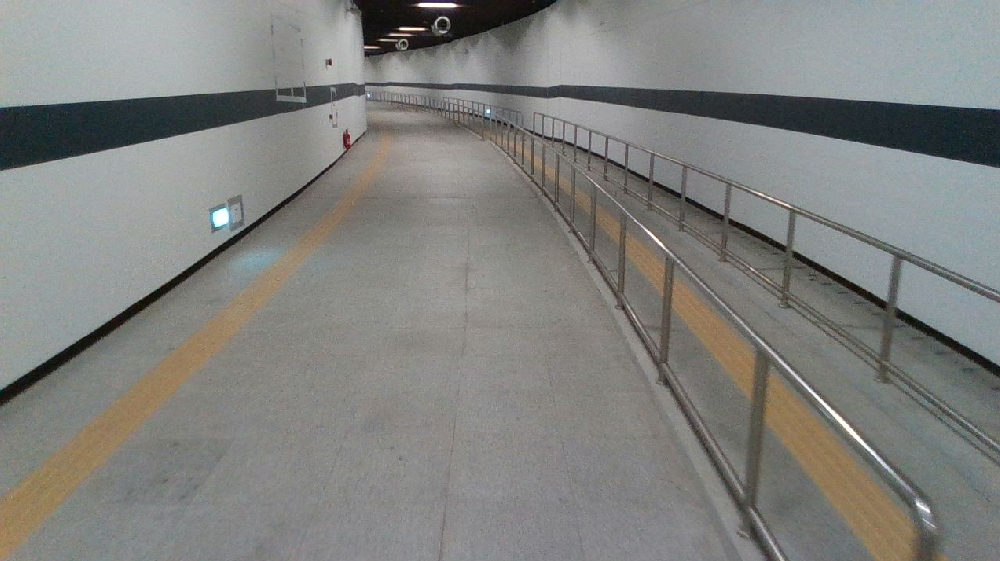</td>
      <td align="center">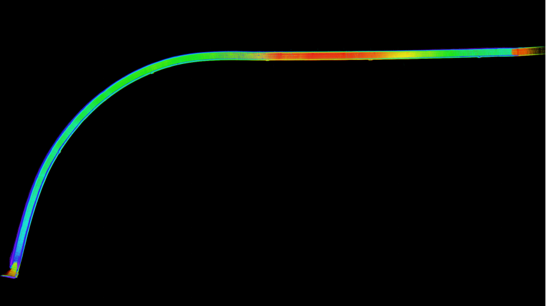</td>
      <td align="center">Handheld</td>
      <td align="center">1127</td>
      <td align="center">709</td>
    </tr>
    <tr>
      <td align="center"><a href="https://drive.google.com/file/d/1HN897oWA8wRhTgNMTZIiWaOud275xtPE/view?usp=sharing">FMCW-LIO_tunnel_03</a></td>
      <td align="center">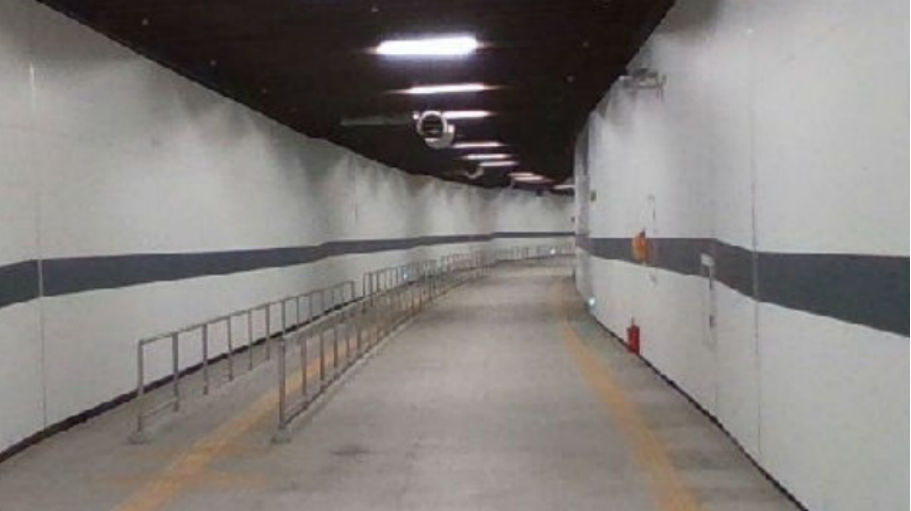</td>
      <td align="center">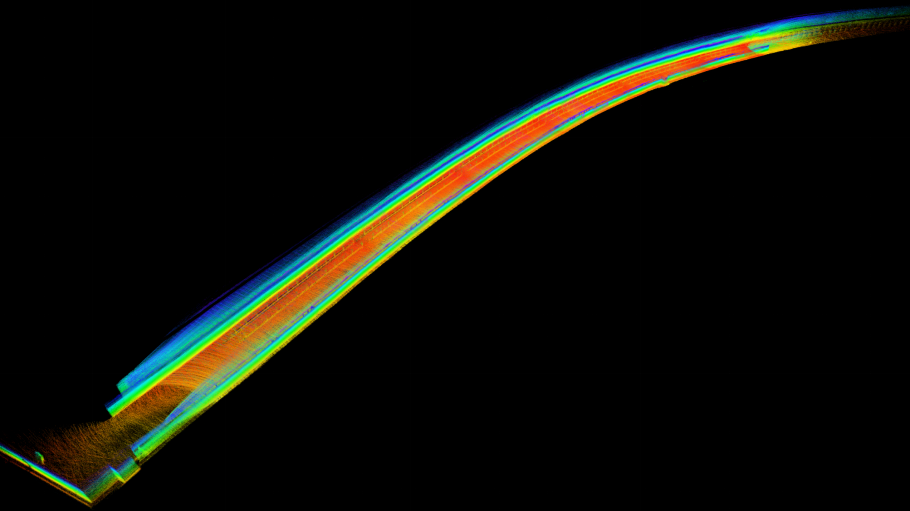</td>
      <td align="center">Handheld</td>
      <td align="center">280</td>
      <td align="center">171</td>
    </tr>
    <tr>
      <td align="center"><a href="https://drive.google.com/file/d/1n4VQbdx3TsM2q_BdNtIJuoSLRxyBM6-q/view?usp=sharing">FMCW-LIO_stpaul_01</a></td>
      <td align="center"></td>
      <td align="center">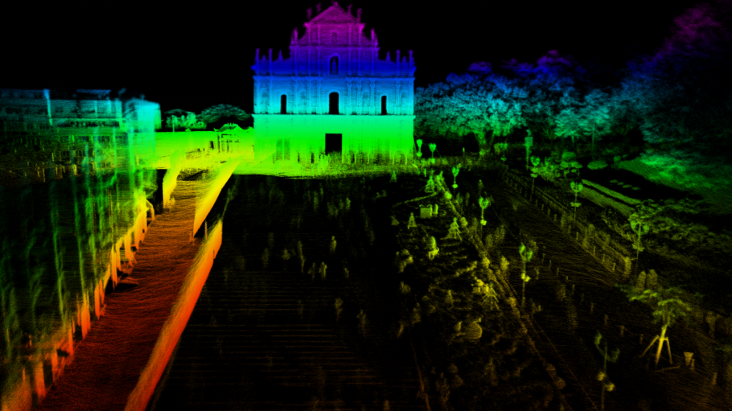</td>
      <td align="center">Handheld</td>
      <td align="center">238</td>
      <td align="center">200</td>
    </tr>
  </tbody>
</table>

## 7. Free-Init Dataset
$\color{#FF577E}{𝙁𝙧𝙚𝙚\text{-}𝙄𝙣𝙞𝙩}$ ([**DOI**](https://doi.org/10.1109/LRA.2024.3490395) | [**Project Page**](https://github.com/IMRL/Free-Init)) is seamlessly integrated into the $\color{#F1261D}{𝗙}\color{#FF9200}{𝗠}\color{#FDDB2A}{𝗖}\color{#4DE42B}{𝗪}\color{#0FF692}{\text{-}}\color{#0BD8F9}{𝗟}\color{#2C22FB}{𝗜}\color{#C32DF3}{𝗢}$ framework. The dataset for qualitative test of dynamic initialization ([**Free-Init Dataset**](https://github.com/IMRL/Free-Init)) is available on [**Hugging Face**](https://huggingface.co/datasets/zha0ming1e/Free-Init_Dataset) and [**Google Drive**](https://drive.google.com/drive/folders/1Zz6WypdraCUC_jD9iLy6nJtJanlxbCz8?usp=sharing). The characteristics of each sequence are summarized in the following table.
<table align="center">
  <thead>
    <tr>
      <th align="center" width="265">Sequence</th>
      <th align="center" width="255">Preview</th>
      <th align="center" width="255">FMCW-LIO Map</th>
      <th align="center" width="105">Platform</th>
      <th align="center" width="105">Distance (m)</th>
      <th align="center" width="105">Duration (s)</th>
    </tr>
  </thead>
  <tbody>
    <tr>
      <td align="center"><a href="https://drive.google.com/file/d/1qGwYWjciOjKOWP5qljyBob4qxZgNAQaW/view?usp=sharing">Free-Init_handheld_campus</a></td>
      <td align="center">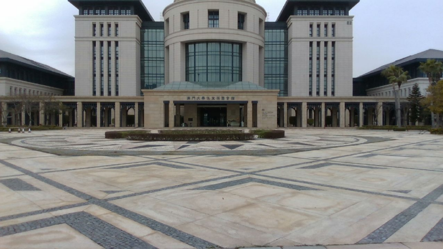</td>
      <td align="center"></td>
      <td align="center">Handheld</td>
      <td align="center">30</td>
      <td align="center">30</td>
    </tr>
    <tr>
      <td align="center"><a href="https://drive.google.com/file/d/1mJqSy6lXiAAaM95J3aTHiJExJB3TpXvx/view?usp=sharing">Free-Init_handheld_tunnel</a></td>
      <td align="center">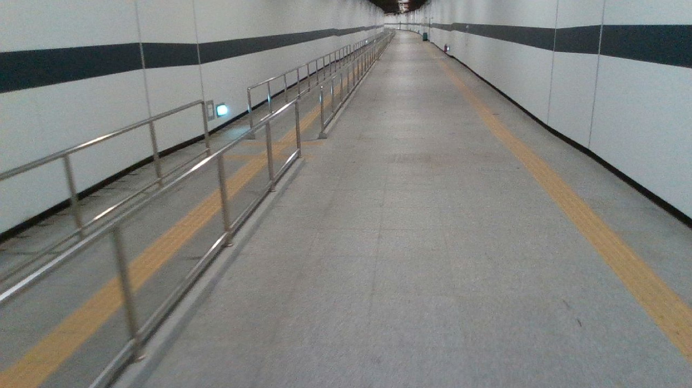</td>
      <td align="center"></td>
      <td align="center">Handheld</td>
      <td align="center">50</td>
      <td align="center">30</td>
    </tr>
    <tr>
      <td align="center"><a href="https://drive.google.com/file/d/16aO7L1RkD3v6VKc2d9YhbWm8SscLxyiu/view?usp=sharing">Free-Init_vehicular_highway</a></td>
      <td align="center"></td>
      <td align="center">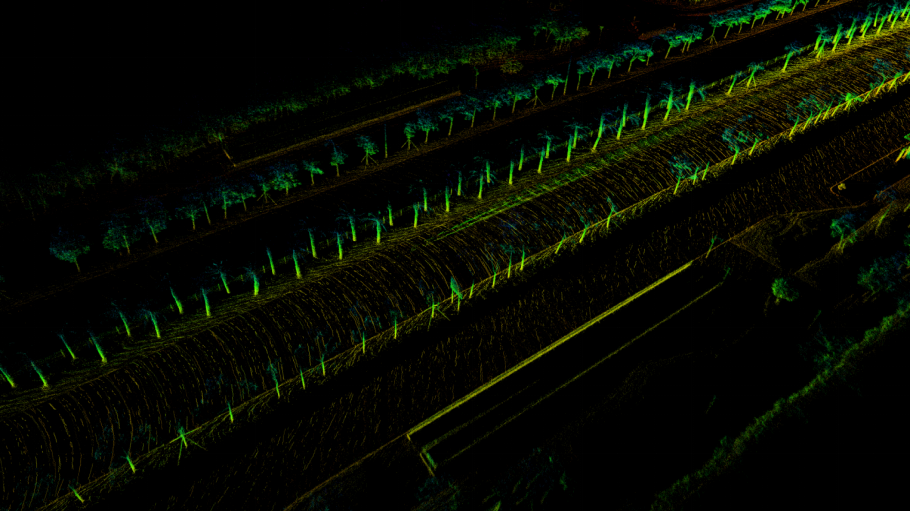</td>
      <td align="center">Vehicular</td>
      <td align="center">553</td>
      <td align="center">30</td>
    </tr>
    <tr>
      <td align="center"><a href="https://drive.google.com/file/d/1QecLekhBZgKQf2SrHZ1knZC0XzZdObBY/view?usp=sharing">Free-Init_vehicular_tunnel</a></td>
      <td align="center"></td>
      <td align="center">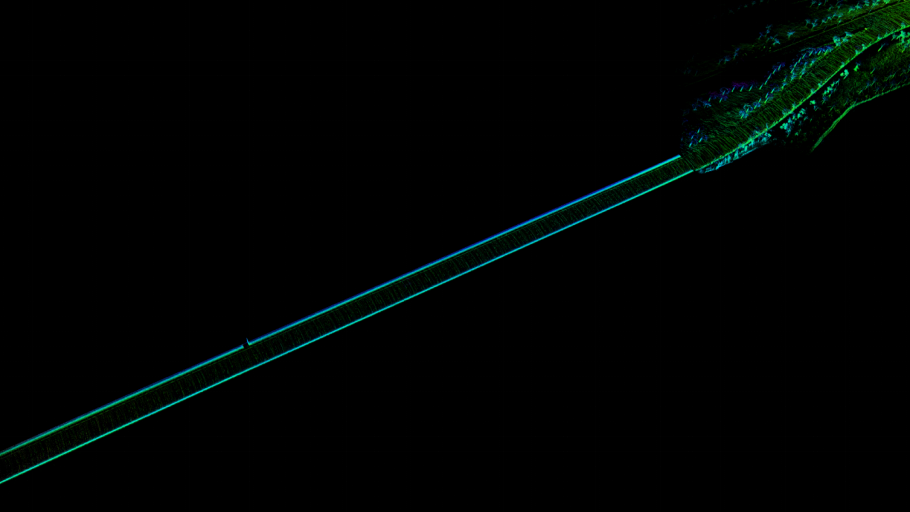</td>
      <td align="center">Vehicular</td>
      <td align="center">562</td>
      <td align="center">30</td>
    </tr>
  </tbody>
</table>

## 8. Citation
If you find our algorithms, datasets, or frameworks helpful in your research, please consider citing our works.
```bibtex
@article{zhao2024fmcw-lio,
  title={FMCW-LIO: A Doppler LiDAR-Inertial Odometry},
  author={Zhao, Mingle and Wang, Jiahao and Gao, Tianxiao and Xu, Chengzhong and Kong, Hui},
  journal={IEEE Robotics and Automation Letters},
  volume={9},
  number={6},
  pages={5727--5734},
  year={2024},
  publisher={IEEE}
}
```
```bibtex
@article{zhao2024free-init,
  title={Free-Init: Scan-Free, Motion-Free, and Correspondence-Free Initialization for Doppler LiDAR-Inertial Systems},
  author={Zhao, Mingle and Wang, Jiahao and Gao, Tianxiao and Xu, Chengzhong and Kong, Hui},
  journal={IEEE Robotics and Automation Letters},
  volume={9},
  number={12},
  pages={11329--11336},
  year={2024},
  publisher={IEEE}
}
```
