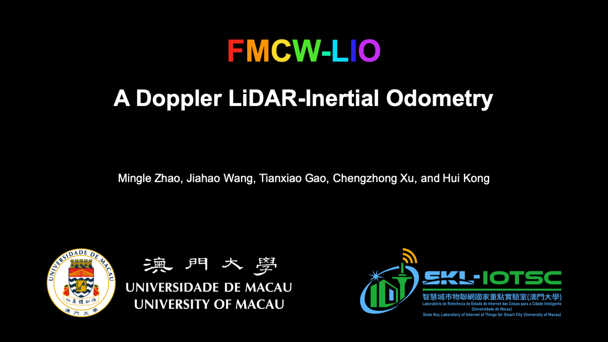

# FMCW-LIO
This is the code repository for the IEEE-RAL'24 paper "FMCW-LIO: A Doppler LiDAR-Inertial Odometry"

# Reference:
FMCW-LIO: Mingle Zhao, Jiahao Wang, Tianxiao Gao, Chengzhong Xu, and Hui Kong, FMCW-LIO: A Doppler LiDAR-Inertial Odometry, IEEE Robotics and Automation Letters (IEEE RA-L), 2024
